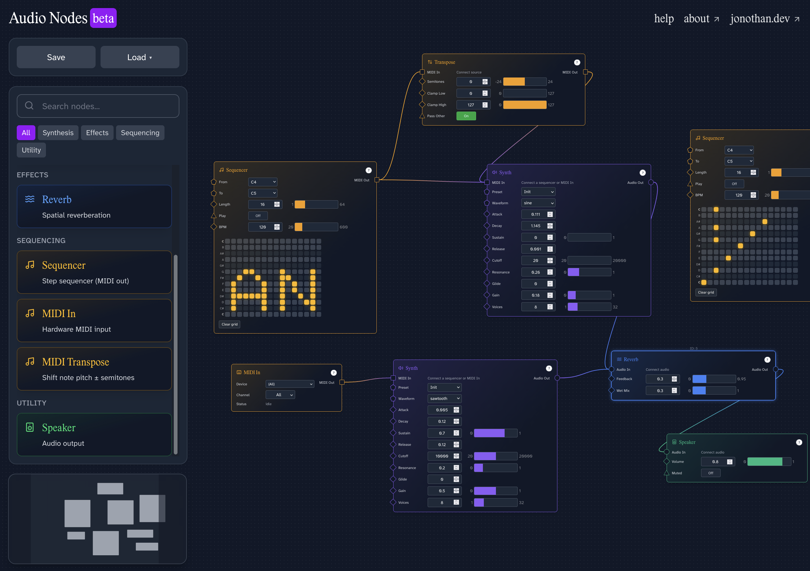

# Audio Nodes

[](https://nodejs.org/)
[](https://www.rust-lang.org/)
[](https://github.com/rustwasm/wasm-pack)

A visual audio playground where you build sound by connecting blocks (nodes). It runs in your browser. Under the hood, the sound engine is written in [Rust](https://www.rust-lang.org/) and compiled to [WebAssembly (WASM)](https://webassembly.org/) for speed; the UI is built with [Next.js](https://nextjs.org/) ([React](https://react.dev/)) and [React Flow](https://reactflow.dev).

Live site: https://audio-nodes.jonothan.dev

I love node‑based creative workflows and making music—so this project is a good opportunity to learn Rust/WASM while making something fun and useful.




## Index

- [Introduction](#introduction)
  - [What is it?](#what-is-it)
  - [How it works](#how-it-works)
- [Developer Guide](#developer-guide)
  - [Prerequisites](#prerequisites)
  - [Installation](#installation)
  - [Build the Audio Engine (WASM)](#build-the-audio-engine-wasm)
  - [Run the app](#run-the-app)
  - [Project structure](#project-structure)
  - [Architecture overview](#architecture-overview)
    - [Audio processing pipeline](#audio-processing-pipeline)
    - [MIDI system](#midi-system)
    - [Beat-only transport & scheduling](#beat-only-transport--scheduling)
    - [UI layer & design language](#ui-layer--design-language)
  - [Authoring nodes](#authoring-nodes)
    - [High-level: audio vs UI responsibilities](#high-level-audio-vs-ui-responsibilities)
    - [Central node metadata registry](#central-node-metadata-registry)
    - [NodeSpec & NodeShell](#nodespec--nodeshell)
    - [Parameters vs streaming IO](#parameters-vs-streaming-io)
    - [Creating a new node (checklist)](#creating-a-new-node-checklist)
    - [Sequencer example (timed/MIDI)](#sequencer-example-timedmidi)
    - [Reverb example (audio effect)](#reverb-example-audio-effect)
  - [Troubleshooting](#troubleshooting)
- [Available nodes](#available-nodes)

---

## Introduction

### What is it?

Audio Nodes lets you create simple synth and effect chains by connecting visual blocks: for example, MIDI Input → Synthesizer → Reverb → Speaker. You can tweak parameters in real time and hear the result instantly.
### Panic Button
Panic (All Notes Off / flush): The transport pill includes a Panic button which sends All Notes Off to every synth, clears active sequencer notes, and clears arpeggiator active outputs to recover from any hanging notes.

- In: MIDI or generated notes (Sequencer)
- Process: Oscillator/Synth, Reverb, Transpose, etc.
- Out: Speaker (final output)

> [!IMPORTANT]
> Audio is silent unless at least one Speaker node is present. Only audio reaching a Speaker input is heard.

### How it works

- Each block (node) does one job (make sound, change sound, or route sound).
- You drag cables between nodes to define the flow.
- The final node “Speaker” is the output to your device—connect to it to hear anything.
- Everything runs in your browser.

---

## Developer Guide

### Prerequisites

- [Node.js](https://nodejs.org/) 18+
- [Rust](https://www.rust-lang.org/) + [wasm-pack](https://rustwasm.github.io/wasm-pack/)

### Installation

```bash
git clone <repository-url>
cd audio-nodes
npm install
```

### Build the Audio Engine (WASM)

Builds the Rust engine and copies wasm-bindgen outputs into both `public/audio-engine-wasm/` and `src/audio-engine-wasm/`:

```bash
npm run build:wasm
```

### Run the app

```bash
npm run dev
# open http://localhost:3000
```

> [!TIP]
> If audio doesn’t start, interact with the page (click) to allow the browser to start the AudioContext.

### Project structure

```
audio-nodes/
├── public/
│   ├── worklets/
│   │   └── audio-engine-processor.js      # AudioWorkletProcessor (runs DSP)
│   ├── audio-engine-wasm/                 # wasm-bindgen output served by Next.js
│   │   ├── audio_engine.js
│   │   ├── audio_engine_bg.wasm
│   │   └── *.d.ts / package.json
│   └── projects/
│       └── default-project.json           # Example project
├── src/
│   ├── app/                               # Next.js App Router
│   │   ├── page.tsx
│   │   ├── layout.tsx
│   │   └── globals.css
│   ├── components/
│   │   ├── nodes/                         # Node UI components (React)
│   │   │   ├── MidiInputNode.tsx
│   │   │   ├── MidiTransposeNode.tsx
│   │   │   ├── OscillatorNode.tsx
│   │   │   ├── ReverbNode.tsx
│   │   │   ├── SequencerNode.tsx
│   │   │   ├── SpeakerNode.tsx
│   │   │   └── SynthesizerNode.tsx
│   │   ├── node-ui/                       # Handle layer + shared node UI
│   │   ├── edges/                         # Custom React Flow edges
│   │   ├── AudioNodesEditor.tsx           # Main editor
│   │   ├── NodeLibrary.tsx                # Node palette/library
│   │   ├── SaveLoadPanel.tsx              # Project persistence UI
│   │   └── TitleBarCreds.tsx              # Header/nav
│   ├── hooks/
│   │   ├── useAudioEngine.ts              # Bootstraps worklet + wasm in page
│   │   ├── useGraph.ts                    # Graph state (React Flow)
│   │   ├── useProjectPersistence.ts       # Save/load (file + localStorage)
│   │   └── useWasm.ts                     # WASM loader glue
│   ├── lib/
│   │   ├── audioManager.ts                # Manages worklet graph + messages
│   │   ├── handles.ts
│   │   ├── nodeRegistry.ts                # Metadata (colors, categories)
│   │   ├── nodes.ts                       # Node type defaults and helpers
│   │   └── utils.ts
│   ├── types/
│   │   └── project.ts
│   └── audio-engine-wasm/                 # Local copy of wasm-bindgen pkg
├── audio-engine/                          # Rust audio processing engine
│   ├── src/
│   │   ├── nodes/
│   │   │   ├── oscillator.rs
│   │   │   ├── reverb.rs
│   │   │   ├── speaker.rs
│   │   │   ├── synth.rs
│   │   │   └── transpose.rs
│   │   └── lib.rs
│   ├── Cargo.toml
│   └── pkg/                               # wasm-pack build output
├── build-wasm.sh                           # Builds + copies wasm artifacts
└── README.md
```

### Architecture overview

#### Audio processing pipeline

- DSP implemented in Rust, compiled with [wasm-bindgen](https://rustwasm.github.io/wasm-bindgen/) to WASM.
- Main thread spins up an [AudioWorkletNode](https://developer.mozilla.org/en-US/docs/Web/API/AudioWorkletNode), fetches glue (`audio_engine.js`) + `.wasm` from `public/audio-engine-wasm/`, then posts to the worklet.
- The [AudioWorkletProcessor](https://developer.mozilla.org/en-US/docs/Web/API/AudioWorkletProcessor) initializes the WASM and processes audio off the main thread.
- UI sends node graph updates and parameter changes via `postMessage` to the worklet.
- [Web Audio API](https://developer.mozilla.org/en-US/docs/Web/API/Web_Audio_API) is used for transport/output (context + destination). All synthesis/effects/mixing happen in WASM.

#### MIDI system

- Raw MIDI bytes for universal compatibility.
- Optional sample‑accurate scheduling using `atFrame` (0..blockSize‑1) or time‑based `atTimeMs`.
- Routing rule: `midi-out → midi-in` only.
- Worklet maintains per‑node MIDI queues and routes messages accordingly.

#### Beat-only transport & scheduling

The engine uses a single always-running global clock measured only in absolute beats (no bars/time-signatures). This keeps polymeter/polyrhythm options open (different sequencer lengths & rate multipliers can drift and phase naturally) without enforcing 4/4 or similar.

Core transport fields (worklet):

```
{
  bpm: number,
  frameCounter: number,       // absolute audio frames processed
  framesPerBeat: number,      // derived from bpm & sampleRate
  nextBeatFrame: number,      // frame index of upcoming beat boundary
  beatIndex: number,          // absolute beat counter (0,1,2,...)
  pendingBpm: number|null,    // scheduled BPM to apply
  pendingBpmBeat: number|null,// beat index when new BPM takes effect
  syncAllNextBeat: boolean    // flag to reset all sequencers at next beat
}
```

Sequencers register with an internal map storing (rateMultiplier, isPlaying, pendingStartBeat, pendingRate, stepIndex, beatsAccum).

Scheduling loop each render block:
1. While `nextBeatFrame` falls inside the current audio block: emit a `beat` message, apply any pending BPM, apply pending per-sequencer rate changes, process syncAll request, start any sequencers whose `pendingStartBeat` just arrived, emit initial step events.
2. Advance `nextBeatFrame += framesPerBeat` until it lies in the future block.
3. For each playing sequencer accumulate fractional beats (`beatsAccum += blockBeats`). When `beatsAccum >= (1 / rateMultiplier)` advance step, wrap by sequence length, emit `sequencerStep`.

All BPM changes, rate changes, sync, and sequencer starts are quantized to the next beat boundary (never mid-step) to avoid timing jitter and preserve deterministic alignment.

#### UI layer & design language

- [React Flow](https://reactflow.dev) for node graph, [Tailwind CSS](https://tailwindcss.com/) for styling.
- Two-column layout: inputs/params (left), outputs (right), both top‑aligned.
- Handle shapes encode type: audio (circle), midi (square), numeric (diamond), boolean (triangle), string/enum (pentagon).
- Accent color used for borders, titles, active handles.

### Authoring nodes

#### High-level: audio vs UI responsibilities

| Layer | Responsibilities |
|-------|------------------|
| Rust (WASM) | Stateful DSP (oscillators, filters, effects), sample-level work, memory-efficient processing. |
| AudioWorkletProcessor | Graph traversal, instantiating WASM node wrappers, routing audio/MIDI, global beat scheduling logic, quantized transport events. |
| AudioManager (main thread) | Maintains graph model, serializes param changes to worklet, exposes subscription APIs (onBeat, onSequencerStep). |
| React Node components | Declarative parameter UI, grid/visual logic (Sequencer), dispatch local param changes via `onParameterChange`. |
| NodeShell framework | Shared layout, handles, help popover, param auto-rendering via NodeSpec. |

#### Central node metadata registry

Display metadata (name, icon, description, category color) lives ONLY in `src/lib/nodeRegistry.ts`. Node components no longer repeat these. `getNodeMeta(type)` returns `{ displayName, icon, accentColor, description, kind }` and `NodeShell` consumes it for consistent UI.

#### NodeSpec & NodeShell

`NodeSpec` now only defines functional aspects (params, streaming IO, optional help & custom render hooks). No icon, no accent, usually no title.

```ts
const spec: NodeSpec = {
  type: 'reverb',
  params: [
    { key: 'feedback', kind: 'number', default: 0.3, min: 0, max: 0.95, step: 0.01, label: 'Feedback' },
    { key: 'wetMix',   kind: 'number', default: 0.3, min: 0, max: 1,    step: 0.01, label: 'Wet Mix' }
  ],
  inputs:  [{ id: 'input',  role: 'audio-in',  label: 'Audio In' }],
  outputs: [{ id: 'output', role: 'audio-out', label: 'Audio Out' }],
  help: {
    description: 'Adds reverberation to the signal.',
    inputs:  [{ name: 'Audio In', description: 'Incoming audio.' }],
    outputs: [{ name: 'Audio Out', description: 'Processed audio.' }]
  }
};

export default function ReverbNode({ id, data, selected }: ReverbNodeProps) {
  return (
    <NodeShell
      id={id}
      data={data}
      spec={spec}
      selected={selected}
      onParameterChange={data.onParameterChange}
    />
  );
}
```

Benefits:
* Uniform layout & styling
* Auto param default application (`useNodeSpec`)
* Kind-driven param component selection
* Centralized help popover + handles + accent color
* Registry-driven icon/name (no duplication)
* Hooks & `children` for custom UI (grids, previews)

#### Parameters vs streaming IO

Distinct concepts:
* Params: Discrete control changes (numbers, bools, selects, text). They propagate through `onParameterChange` once per user edit and are posted to the worklet. They may expose param-input handles (future modulation system) but are not continuous sample streams.
* Streaming IO: Audio or MIDI edges defined in `inputs` / `outputs` arrays. These drive per-block data flow.

Why separate? Clear semantics (sample-stream vs control event) keeps scheduling deterministic and reduces accidental over-posting.

#### Creating a new node (checklist)

1. Registry: Add entry in `nodeRegistry.ts` (type, name, description, icon, category). No display props in the component.
2. DSP (if needed): Implement Rust node + expose via `lib.rs`; rebuild WASM.
3. Worklet: Instantiate/process in `audio-engine-processor.js` (audio or MIDI path).
4. UI: Create `src/components/nodes/<Name>Node.tsx` with minimal `NodeSpec` (params, inputs/outputs, help) and return `<NodeShell />`.
5. Register node component in editor `nodeTypes` (if not auto-wired).
6. Verify in browser (add node, tweak params, inspect behavior/messages).
7. Persistence: Ensure defaults present; project save/load should “just work”.
8. Optional custom UI via `renderBeforeParams` / `renderAfterParams` or `children`.
9. Docs/tests as complexity grows.

#### Sequencer example (timed/MIDI)

The Sequencer demonstrates custom UI + transport integration:
* Spec defines From, To, Length, Play, Rate params.
* A custom step grid is passed as `children` to `NodeShell`.
* Play & Rate changes dispatch custom DOM events (`audioNodesSequencerPlayToggle`, `audioNodesSequencerRateChange`), which the editor converts into `audioManager.setSequencerPlay/Rate` messages.
* Worklet maintains quantized start (`pendingStartBeat`) and per-beat step advancement using `rateMultiplier`.
* Rate changes and starts apply exactly on the next global beat.

Key sequencing fields (worklet per entry):
```
{
  rateMultiplier, isPlaying,
  pendingStartBeat, pendingRate,
  stepIndex, beatsAccum, _startedOnce
}
```

#### Reverb example (audio effect)

Straightforward spec → NodeShell. DSP lives in Rust; worklet caches an instance per node ID, pulling/mixing upstream audio recursively. Parameters (feedback / wetMix) are posted only when changed, minimizing overhead.

#### Transport interaction helpers

`AudioManager` exposes:
```ts
audioManager.onBeat((beatIndex, bpm) => { /* UI updates */ });
audioManager.syncAllNextBeat();
audioManager.setBpm(138); // applies next beat
audioManager.setSequencerPlay(nodeId, true);
audioManager.setSequencerRate(nodeId, 0.5);
```

Avoid scheduling mid-beat where phase alignment matters—post changes early enough that they land on the boundary.

### Troubleshooting

- No sound? Add a Speaker node and ensure an audio signal reaches it.
- Browser blocked audio start? Click anywhere (user gesture) to start the AudioContext.
- WASM didn’t load? Run `npm run build:wasm` and check the console for network errors loading files in `public/audio-engine-wasm/`.

[Back to top](#audio-nodes)


## Next steps: Global tempo and sequencer sync (spec + implementation plan)

Goal: Keep the system always-live and simple. Use a single global BPM with per-sequencer rate multipliers, quantized (next-beat) starts, and an optional "Sync all on next beat" action. Provide a subtle beat indicator near BPM.

Outcome at a glance
- One global BPM drives an always-running clock (hidden transport).
- Sequencers have Rate multiplier only (no per-node BPM).
- Play acts as a gate; starts are quantized to the next beat.
- "Sync all on next beat" restarts all sequencers at step 0 on the next beat.
- Beat LED flashes each beat; BPM changes apply on the next beat.

Constraints
- Keep UI minimal; no visible transport bar.
- Preserve existing play wiring; just add quantization.
- Avoid mid-block changes that cause timing jitter; schedule changes on beat boundaries.

Implementation checklist (GitHub style)

### 1. Worklet: global transport & scheduling (beat-only)
- [x] Core transport timing & fields
- [x] Beat emission & pending BPM application
- [x] Sequencer registry with quantized start & rate changes
- [x] Sync-all & step advancement logic
- [x] Message handlers (BPM, rate, play, sync)
- [x] Outbound events (beat, sequencerStep, syncScheduled)

### 2. UI: Transport & controls
- [x] Draggable transport pill (persisted)
- [x] Beat LED pulse
- [x] BPM input (quantized apply + keyboard inc/dec)
- [x] Sync-all button
- [x] Panic (All Notes Off) button
- [x] WAV recording & preview modal (custom player)
- [x] Master mute (with preview layer mute)

### 3. Sequencer node UI changes
- [x] Remove per-node BPM param
- [x] Add Rate select (0.25x,0.5x,1x,2x,4x)
- [x] Update help text for quantized start & rate
- [x] Play toggle dispatches global play (quantized)
- [x] Transient hint after changing rate while playing

### 4. Data model & persistence
- [x] Extend project schema: add transport { bpm }
- [x] Add sequencer.rateMultiplier default 1.0
- [x] Remove old per-node bpm field (migration)
- [x] Load logic defaults missing rateMultiplier to 1.0
- [x] Persist & restore actual transport BPM (stored on window & serialized)

### 5. Node registry / defaults
- [x] Central node metadata (single source of truth)
- [x] Node components stripped of duplicate display data
- [x] Registry-driven accent/icon/title resolution in NodeShell

### Modulation

Implemented LFO (sync via beats-per-cycle). Future: random/S&H, per-destination depth, waveform preview, advanced routing.

### 6. Acceptance criteria verification
- [x] Sequencers remain aligned long-term
- [x] BPM change quantized
- [x] Rate change quantized
- [x] Sync-all restart accurate
- [x] New sequencer joins on boundary
- [x] Debounced rapid play toggles

### 7. Edge case handling
- [x] Immediate gate on stop
- [x] Registry cleanup on removal
- [x] Multi-sequencer stable performance

### 8. Manual test plan execution
- [x] Core manual tests executed (tempo, sync, alignment, recording, mute)

### 9. Follow-ups (deferred)
- [ ] Dotted/triplet multipliers (1.5x, 0.666x)
- [ ] Per-node quantize options (Bar/Beat/1/8/1/16)
- [ ] Alternate clock domains / Clock node
- [ ] Variable time signatures & swing

Development notes (pointers)
- Worklet timing: `public/worklets/audio-engine-processor.js`
- Messaging & orchestration: `src/lib/audioManager.ts`, `src/hooks/useAudioEngine.ts`
- Sequencer UI: `src/components/nodes/SequencerNode.tsx`
- Persistence: `src/hooks/useProjectPersistence.ts`, `src/types/project.ts`
- Meta: `src/lib/nodeRegistry.ts` (categories & listing); param defaults live in each Node component's NodeSpec

This checklist lets us tick progress transparently as each layer lands.


## Project plan (roadmap)

This is a living checklist of planned features. Tick items will be updated as we land them. Feel free to open issues/PRs to discuss or contribute.

### Core nodes

- [x] Arpeggiator (modes, rate, octaves, quantized play)
- [x] LFO (initial shapes, sync, param-out)
- [ ] LFO enhancements (random/S&H, preview, advanced routing)
- [ ] Envelope (ADSR, multi-stage, trigger modes)
- [ ] Sampler (load, playback modes, mapping, streaming)

### Effects nodes

- [ ] Delay (mono/stereo)
  - [ ] Time (ms/sync), feedback, mix
  - [ ] Ping-pong mode
- [ ] Chorus/Flanger
  - [ ] Rate, depth, feedback, mix
- [ ] Phaser
  - [ ] Stages, rate, depth, feedback, mix
- [ ] Distortion/Saturation
  - [ ] Drive, tone, mix; multiple curves
- [ ] EQ (simple 3-band)
  - [ ] Low/Mid/High gain, frequency, Q (where applicable)
- [ ] Compressor
  - [ ] Threshold, ratio, attack, release, makeup gain
- [ ] Filter node (separate from synth)
  - [ ] LP/HP/BP/Notch, cutoff, resonance, key track

### Utilities and routing

- [ ] Mixer node (multi-input)
- [ ] Splitter/Merger nodes
- [ ] Gain node
- [ ] Meter/Scope/Analyzer (visualization)
- [ ] MIDI utilities: Scale quantizer, Velocity curve, Channel filter

### Editor UX

- [x] Copy/Paste selection (Cmd/Ctrl+C, Cmd/Ctrl+V)
- [x] Duplicate selection (Cmd/Ctrl+D)
- [x] Spawn new nodes at viewport center
- [ ] Multi-select marquee improvements
- [ ] Align/distribute selected nodes
- [ ] Snap grid settings and quick toggle
- [ ] Keyboard shortcuts reference overlay
- [ ] Context menu (right-click) for quick actions

### Project system

- [ ] Versioned project format with migrations — so older projects keep working as the app evolves
- [ ] Asset management (samples), project-local asset store — keep audio files with the project for easy moving/sharing
- [ ] Share/import projects via URL or file — quickly share patches or load presets from a link/file

### Performance and engine

- [ ] Audio engine profiling and benchmarks — measure where time goes to target the biggest speed-ups (recommended by AI)
- [ ] SIMD builds (wasm32-simd128) where available — use special CPU instructions to process many samples at once for smoother playback (recommended by AI)
- [ ] Worklet ring buffer optimizations — a faster pipe between the UI and the audio thread to reduce glitches and latency (recommended by AI)
- [ ] Offline render/export to WAV — render your patch to an audio file you can download

### Documentation

- [x] Central registry & authoring instructions updated
- [ ] Node reference docs (per node)
- [ ] Modulation/handles guide
- [ ] Contributing guide
- [ ] Architecture deep dive (engine + UI)

Have an idea for a node or feature? Open an issue with [feature] in the title and describe the use case. Contributions welcome!