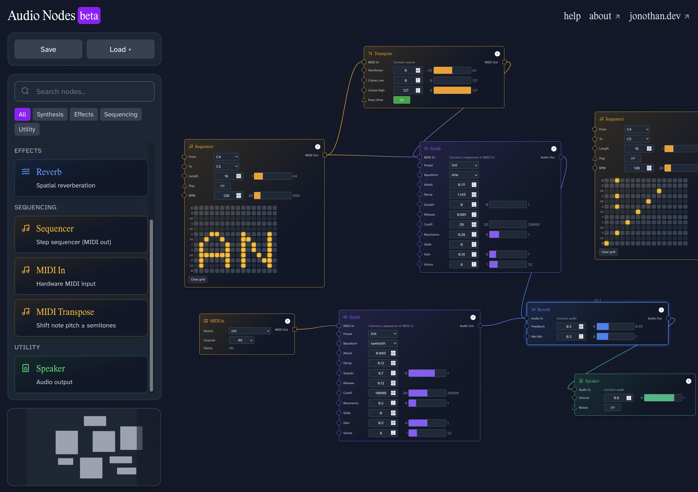

<p align="center">
  
</p>

<h1 align="center">Audio Nodes</h1>

<p align="center">
  <a href="https://nodejs.org/">=18" src="https://img.shields.io/badge/node-%3E%3D18-brightgreen" /></a>
  <a href="https://www.rust-lang.org/"></a>
  <a href="https://github.com/rustwasm/wasm-pack"></a>
  <a href="./LICENSE"></a>
</p>

<p align="center"><strong>Modular audio & MIDI playground in the browser.</strong><br/>Rust + WebAssembly DSP core • Next.js UI • React Flow graph</p>

<p align="center"><a href="https://audio-nodes.jonothan.dev">audio-nodes.jonothan.dev</a></p>

## Table of Contents

1. [Introduction](#introduction)
2. [Quick Start](#quick-start)
3. [Project Structure](#project-structure)
4. [Technical Rundown](#technical-rundown)
5. [Authoring a Node](#authoring-a-node)
6. [Troubleshooting](#troubleshooting)
7. [Roadmap & TODO](#roadmap--todo)
8. [Contributing](#contributing)
9. [License](#license)
---

## Introduction

Design synth / effect / MIDI chains visually (e.g. MIDI In → Synth → Reverb → Speaker). Patch cables, tweak parameters, and the low‑latency Rust/WASM engine reacts instantly. All inside your browser – no install besides dependencies.

I love node‑based creative workflows and making music—so this project is a good opportunity for me to learn Rust/WASM while making something fun and useful.

---

## Quick Start

### Prerequisites

- Node.js 18+
- Rust toolchain + wasm-pack

### Install

```bash
git clone https://github.com/jonothanhunt/audio-nodes.git
# or (SSH)
# git clone git@github.com:jonothanhunt/audio-nodes.git
cd audio-nodes
npm install
```

### Build the Audio Engine (WASM)

Compiles the Rust crate and copies wasm-bindgen artifacts into `public/audio-engine-wasm/` (served) and `src/audio-engine-wasm/` (type usage).

```bash
npm run build:wasm
```

### Run

```bash
npm run dev
# then open http://localhost:3000
```

Tip: If the browser blocks autoplay, click anywhere to unlock the AudioContext.

---

## Project Structure

```
audio-nodes/
├── public/
│   ├── worklets/                # AudioWorkletProcessor script
│   ├── audio-engine-wasm/       # Served WASM bundle
│   └── projects/                # Example / default project JSON
├── src/
│   ├── app/                     # Next.js App Router entry
│   ├── components/              # React components (nodes, editor, UI chrome)
│   ├── hooks/                   # Engine, graph, persistence hooks
│   ├── lib/                     # Core managers, registry, helpers
│   ├── types/                   # Shared TypeScript types
│   └── audio-engine-wasm/       # Local copy of wasm-bindgen pkg (types)
├── audio-engine/                # Rust DSP crate (compiled to WASM)
└── build-wasm.sh                # Convenience build + copy script
```

---

## Technical Rundown

### Architecture Overview

Layered for clarity & iteration speed:
- **Rust (WASM):** Sample‑level DSP (oscillator, poly synth, reverb, LFO, MIDI transpose). Compiled via `wasm-bindgen`.
- **AudioWorkletProcessor** (`public/worklets/audio-engine-processor.js`): Owns the instantiated WASM module. Executes the per‑block render, routes audio/MIDI, advances the global beat clock, dispatches transport events, and applies param modulations.
- **Main thread** (`AudioManager`, `GraphSync`, `Transport`): Maintains the declarative graph & param state; serializes diffs to the worklet; routes worklet events back to React.
- **React UI:** Graph editing (React Flow), parameter panels (auto‑generated from `NodeSpec`), custom node UIs (sequencer grid, etc.).

### Audio Processing Pipeline
1. User edits graph in React → diff sent to worklet via `GraphSync`.
2. Each audio block the worklet runs a pre-pass: value-node chains propagated (`_propagateValueNodes`), then sequencer/arp param modulations applied.
3. Worklet resolves a topological order and pulls audio upstream each block via WASM instances.
4. Output written to the worklet's output channels → system audio.

### Param Modulation System
Param connections (e.g. Bool → sequencer `playing`, LFO → oscillator `frequency`) are a first-class feature:
- **Source types:** `value-bool`, `value-number`, `value-select` (static values), or `lfo` (per-block computed values).
- **Value-node chaining:** Bool A → Bool B → sequencer works; the worklet propagates value-node chains before running modulations (`_propagateValueNodes`), supporting up to 4 levels of depth per block.
- **Live UI preview:** When a param handle has an incoming connection, the control is disabled but its colour/value updates in real time via `modPreview` messages from the worklet → `audioNodesNodeRendered` window event → `useLiveParamModulation` hook → `BooleanParam` / `NumberParam` display.
- **Single-source rule:** MIDI and param handles each accept only one incoming connection. Audio inputs allow fan-in (mixing).
- **Logic & Math Processing:** Dynamic nodes (Add, Subtract, Gate, Comparator, Conditional) are instantly evaluated synchronously within the modulation loop (up to 4 levels deep), enabling you to perform boolean mapping, variable routing, and arithmetic per-block.

### Transport & Scheduling (Beat‑Only)
- Single global beat clock (no bars / signatures) encourages polymeter & drifting patterns.
- BPM changes, sequencer starts, rate changes & global sync requests are quantized to the next beat boundary for deterministic alignment.
- Sequencers accumulate fractional beats; when threshold reached, they advance a step and emit events (used by UI for visual feedback / grid highlight).

### MIDI & Routing
- Raw MIDI bytes (status, data1, data2) for maximum flexibility.
- Edges are type-safe: audio↔audio, midi↔midi, param↔param (no implicit conversions). Enforced in `isValidConnection` in `useGraph.ts` via `handles.ts`.
- Worklet maintains per-node MIDI queues processed each render quantum.

### Node Metadata & UI Generation
- **Visual/descriptive metadata** lives centrally in `nodeRegistry.ts` (display name, icon, accent colour, description, category).
- **Functional spec** (params, IO handles, help text) lives in each node component as a `NodeSpec` object — for static nodes this is a module-level `const`, with only dynamic render callbacks inside `useMemo`.
- **Handle connection roles** are registered separately in `handles.ts` (`getHandleRole`). This is the one area where two files must stay in sync when adding a new node type.
- `NodeShell` consumes both to render a consistent layout (param rows, handles, help popover) while allowing custom `children` for rich UIs (e.g. sequencer grid).

### Parameters vs Streaming IO
- **Parameters:** Discrete control values (numbers, bools, selects) that can be both directly edited via UI and overridden by connected param sources.
- **Streaming IO:** Continuous audio or MIDI buffers routed every block.

This separation keeps bandwidth low and timing precise.

---

## Authoring a Node

A node has up to four concerns: **registry entry**, **handle roles**, **UI component**, and **worklet handler**. Steps 1–2 are always required; 3 and 4 only if the node does something the worklet needs to know about.

### 1. Registry entry — `src/lib/nodeRegistry.ts`

Add a record with `type`, `displayName`, `icon`, `accentColor`, `description`, and `category`:

```ts
{ type: 'my-node', displayName: 'My Node', icon: SomeIcon, accentColor: '#7c3aed', description: '...', category: 'Utility' }
```

### 2. Handle roles — `src/lib/handles.ts`

Add a `case` for your node type in `getHandleRole`. This is what enforces type-safe connections (audio↔audio, midi↔midi, param↔param):

```ts
case 'my-node':
    if (handleId === 'output') return 'audio-out';
    if (handleId === 'cutoff') return 'param-in';  // allows LFO/value modulation
    return 'unknown';
```

> **Note:** This is currently the one place where two files (`handles.ts` + the component's `NodeSpec`) must stay in sync. A param handle only receives modulation connections if it is listed as `param-in` here **and** declared in `NodeSpec.params` with `handle: true` (the default).

### 3. UI component — `src/components/nodes/<Category>/<Name>Node.tsx`

Define a `NodeSpec` (as a **module-level const** for static data — only `renderBeforeParams`/`renderAfterParams` closures go inside `useMemo`):

```tsx
"use client";
import { NodeShell } from '../../node-framework/NodeShell';
import { NodeSpec } from '../../node-framework/types';

const spec: NodeSpec = {
  type: 'my-node',
  params: [
    { key: 'cutoff', kind: 'number', default: 800, min: 20, max: 20000, step: 1, label: 'Cutoff' },
    { key: 'enabled', kind: 'bool', default: true, label: 'Enabled' },
    // handle: false — hides the param-in handle for this param (user-only control)
    { key: 'mode', kind: 'select', default: 'low', options: ['low', 'high', 'band'], label: 'Mode' },
  ],
  inputs:  [{ id: 'input', role: 'audio-in', label: 'In' }],
  outputs: [{ id: 'output', role: 'audio-out', label: 'Out' }],
  help: {
    description: 'A filter node.',
    inputs:  [{ name: 'In', description: 'Audio input.' }],
    outputs: [{ name: 'Out', description: 'Filtered audio.' }],
  },
};

interface Props { id: string; selected?: boolean; data: Record<string, unknown> & { onParameterChange: (...) => void }; }

export default function MyNode({ id, data, selected }: Props) {
  return <NodeShell id={id} data={data} spec={spec} selected={selected} onParameterChange={data.onParameterChange} />;
}
```

`NodeShell` handles param rows, input/output handles, the help popover, and the live modulated param preview automatically. Pass optional `children` for custom UI (e.g. a grid or scope).

#### Param kinds

| `kind`    | Control rendered   | Value type         |
|-----------|--------------------|--------------------|
| `number`  | Number input + optional slider (when `min`+`max` set) | `number` |
| `bool`    | Toggle button (shows live modulated state when connected) | `boolean` |
| `select`  | Dropdown           | `string`           |
| `text`    | Text input         | `string`           |

All param-in handles automatically support modulation from `value-bool`, `value-number`, `value-select`, and `lfo` nodes. Disable the handle for a param with `handle: false` in its spec entry.

#### Pure value / pass-through nodes

If your node just emits a value (no audio/MIDI), omit `inputs` and use a `param-out` output:

```ts
outputs: [{ id: 'param-out', role: 'param-out', label: 'Out' }]
```

The worklet's `_propagateValueNodes` automatically propagates value-node chains (`_nodes.value`) before running modulations each block — chains up to 4 levels deep work without any extra worklet code.

### 4. Worklet handler — `public/worklets/audio-engine-processor.js`

Only needed if your node produces audio or MIDI, or has stateful per-block logic. Add:
- A `_nodes.type === 'my-node'` branch in `_processInputNode` (for audio) or the MIDI queue drain (for MIDI processors).
- Call `this._applyParamModulations(nodeId, data)` at the **start** of your render function to apply any incoming param connections before reading values.
- If WASM-backed: instantiate lazily via a `_getMyNodeInstance(nodeId)` pattern matching `_getOscInstance`, `_getSynthInstance`, etc.

### 5. Register in the editor — `src/components/AudioNodesEditor.tsx`

Add to the `nodeTypes` map:

```ts
import MyNode from './nodes/Category/MyNode';
// ...
const nodeTypes = { ..., 'my-node': MyNode };
```

### 6. Test

- Add node to canvas, connect cables, wiggle all params.
- Connect a `value-bool` or `value-number` to param handles — confirm they disable in UI and correctly modulate the value.
- Save, reload, confirm state persists via localStorage/JSON round-trip.
- Check DevTools console for worklet errors.

---

## Troubleshooting

| Symptom | Fix |
|---------|-----|
| Silence | Ensure a Speaker node is in the chain & receiving audio. |
| Audio won’t start | Click the page (user gesture needed to start AudioContext). |
| WASM 404 / load error | Run `npm run build:wasm` and verify files in `public/audio-engine-wasm/`. Hard refresh. |
| Params not updating | Confirm node type spec keys match what worklet expects; check devtools messages. |
| Timing feels off | Verify BPM change or sequencer start was scheduled before the desired beat (changes quantize to next beat). |

Still stuck? Open an issue with console logs + reproduction steps.

---

## Roadmap & TODO

### Core / DSP
- [ ] Delay (mono / ping‑pong)
- [ ] Filter (standalone multi-mode)
- [ ] Sampler (basic one‑shot / loop)
- [ ] Envelope generator (ADSR) + modulation outputs
- [ ] Chorus / Flanger / Phaser
- [ ] Distortion / Saturation + simple tone shaping
- [ ] EQ (3‑band) & Compressor
- [ ] Offline render / export
- [ ] SIMD exploration / profiling passes

### Modulation & Control
- [ ] LFO enhancements (random, S&H, preview)
- [ ] Per‑destination modulation depth
- [ ] Mod matrix / routing panel


### MIDI / Sequencing
- [ ] Scale quantizer
- [ ] Velocity curve
- [ ] Channel filter
- [ ] Arp pattern variations & direction modes
- [ ] Alternate clock domains / Clock node

### Routing & Utility
- [ ] Gain node
- [ ] Mixer (summing + per‑channel mute/solo)
- [ ] Meter / Analyzer / Scope
- [ ] Splitter / Merger utilities

### Editor / UX
- [ ] Multi‑select improvements (box select refinements)
- [ ] Snap grid toggle & alignment guides
- [ ] Shortcut reference / quick help palette
- [ ] Align / distribute commands
- [ ] Context menu actions (duplicate, isolate, bypass)
- [ ] Project sharing & asset management

### Transport & Timing
- [ ] Dotted / triplet rate multipliers
- [ ] Swing & per‑sequencer quantize options
- [ ] Advanced LFO shapes & per‑destination depth curves

### Documentation
- [ ] Per‑node reference pages
- [ ] Contributing guide
- [ ] Modulation guide
- [ ] Deep dive (engine + scheduling)

### Quality / Maintenance
- [ ] Panic tests & regression checks
- [ ] Ring buffer / allocation audit
- [ ] CI build (lint + type + wasm)

Completed (highlights):
- [x] Rust WASM core (oscillator, poly synth, reverb, LFO, MIDI transpose)
- [x] Beat scheduling & quantized events
- [x] React Flow editor with persistence (localStorage + JSON import/export)
- [x] Parameter spec system + centralized registry
- [x] WAV recording, master mute, panic, help popovers
- [x] Param modulation system — value nodes (bool, number, select) and LFO can drive any param-in handle
- [x] Live modulated param preview — disabled controls show real-time worklet values via `useLiveParamModulation`
- [x] Value-node chaining (Bool A → Bool B → sequencer) via `_propagateValueNodes`
- [x] Single-source connection enforcement for MIDI and param handles
- [x] Type-safe `AudioNodeData` covering all node param fields

---

## Contributing

PRs and issues welcome. For sizeable DSP or architectural changes, open an issue first outlining intent + rough approach. Keep nodes focused (single responsibility) and prefer extending shared primitives where possible.

---

## License

MIT © 2025 Jonothan Hunt — see [LICENSE](./LICENSE) for full text.

---

<sub>Built for fun, learning, and sonic experiments. Have ideas? Share them!</sub>